# Supabase SvelteKit Client:  Part 2 - Update, and Delete Products

Enda Lee 2022

### Quick Start

1. Download or `fork` the start site from this repository.
2. Open in VS Code.
3. copy `sample.env` to `.env` and configure for your Supabase connection.
4. In a terminal run `npm install`
5. Start the application using `npm run dev`


## Introduction

In this tutorial you will add Update and Delete functionality to the application, along with sortable columns. The finished page will look like this example:

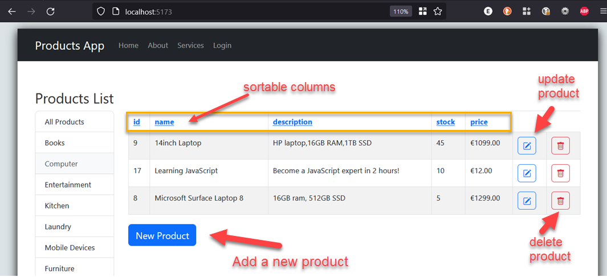

## 1. Pre-requisites

The application will use **separate** **`client`** and **`server`** applications which should be opened in separate VS Code instances when working on this lab.

##### Server-side

Make sure that your Supabase database instance is setup and running


## 2. The start site

#### 2.1. The main products page

When http://localhost:5173 loads first, the empty default page looks like the following. Note the completed column sort functionality.


## 3. Column sorting

This feature is implemented in the start site. When a column header in the table is clicked, the table is sorted by that column - either in ascending or descending order.

To support this functionality, filtered is used as a *subscribed* 'copy' of `$product`. This is because `$product` is not compatible with the JavaScript Array `sort` method.   You will see that `filtered` is also used in the loop which fills the products table.

```javascript
	$: filtered = $products;
```


Open `scr/routes/+page.svelte` to see the `on:click` handlers of each table header. Note that the call to `sortNumeric()` or `sortAlpha()` depending on the data type to be sorted. 

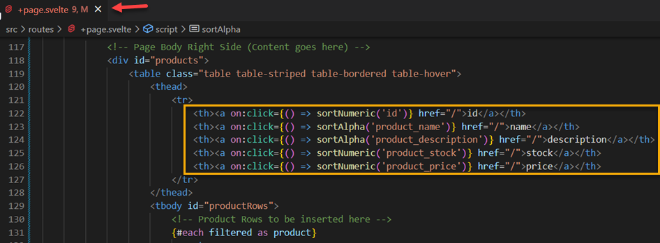


further up in  `scr/routes/+page.svelte` you can see the object used to keep track of sort direction and also the functions.

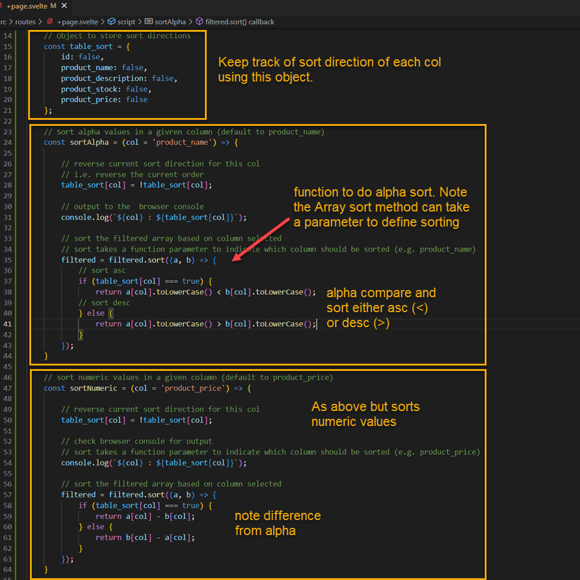


## 4. Updating and Deleting Products

The Introduction screenshot above shows two buttons which will be used to update or delete products. Each product in the table will have its own buttons so that when they are clicked, the appropriate route or function can be called and a parameter passed.

 

### 4.1. Add the buttons

The buttons above are styled using Bootstrap 5 icons. The full set can be found at https://getbootstrap.com/docs/5.0/extend/icons/

The required CSS has is imported in `src/app.html` along with the other Bootstrap 5 dependencies.

The two buttons should be added to the table after the existing table data (`src/routes/+page.svelte`). The route to `/updateproduct/[id]` and the `deleteProduct(id)` function will be added later.

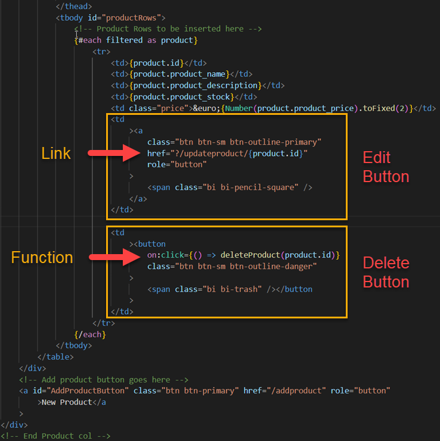


### 4.2. Delete a product by id

When one of the the bin icons is clicked, its associated product should be deleted by its `id`. It is always a good idea to confirm a permanent changes such as delete, this can be achieved using a standard JavaScript prompt dialog. 

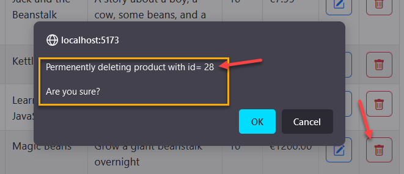


The `deleteProduct()` function should be added to the `<script>` section of the page. For now it displays the prompt and outputs to the console:

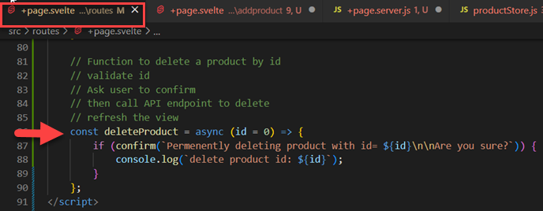


The functionality to delete via an API call is missing and currently clicking ok will only log a message to the console.

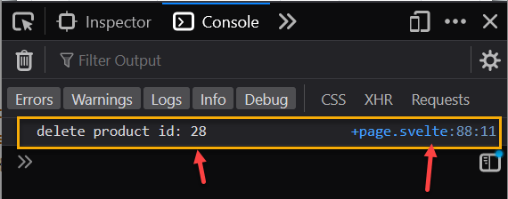


**Complete the function so that it deletes the product by id using the `product store` and and an API call by adding he following:**

1. Add/ Modify the `deleteProductById(id)` function in **`productsStore.js`**. It should accept the product id as a parameter and call the Supabase API to perform the delete.
2. Import `deleteProductById` in the product display page.
3. Call the function from `deleteProduct()` after user confirmation.
4. Reload the products list.


### 5.2 Update an existing product

Clicking the pencil (edit) icon for a product will navigate to the `/editproduct/[id]` route:

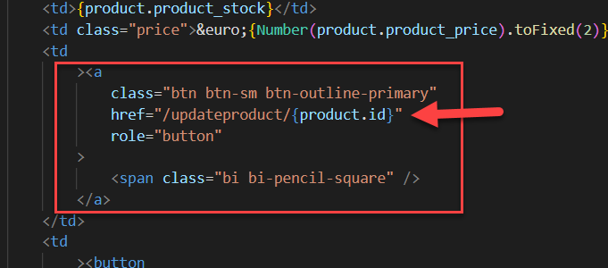


This will display a message confirming the `id` param from the URL: 

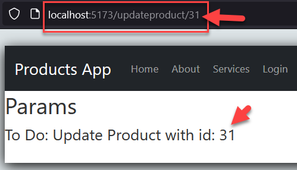


The param is defined by creating a subfolder named `[id]` in the `updateproduct` route folder. 

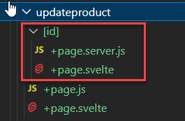

`updateproduct/[id]/+page.svelte` contains the code to read the `id` parameter value from the `URL` and display it:

```html
<script>
    import { page } from '$app/stores';

</script>
  
  <h1>Params</h1>
  {#if ($page.params.id)}
    <h3>To Do: Update Product with id: {$page.params.id}</h3>
  {/if}
```

#### **To Do:** Add a form so that the product matching this id can be updated and submitted (similar to adding a new product).

Form actions, etc. should be defined in `updateproduct/[id]/+page.server.js`. Also add the required product store function.


##### 5.2.1. For reference: QueryString version http://localhost:5173/updateproduct?id=88888

If you need to send a parameter via the URL query string, you will find an example in `updateproduct/+page.svelte` and `updateproduct/page.js` 

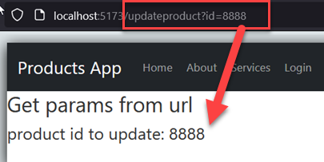


------

Enda Lee 2022
